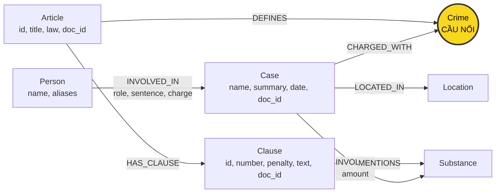

# Thiết kế Ontology — Day 19

**Họ tên:** Hà Anh Tuấn  **MSSV:** 2A202602376

**Lựa chọn** (đánh dấu một):
- [X] Dùng ontology gợi ý (có thể chỉnh nhỏ)
- [ ] Tự thiết kế (xét bonus +15, xem `SUBMISSION.md`)

> Hướng dẫn: `LAB_GUIDE.md` Bước 2. Dùng ontology gợi ý thì vẫn phải điền đủ các mục dưới đây bằng lời của bạn.

## 1. Sơ đồ

## 2. Entity types (node labels)

| Label | Ý nghĩa | Khóa định danh (`MERGE` theo) | Properties | Lấy từ KB nào | Trích bằng (regex / LLM / khác) |
| --- | --- | --- | --- | --- | --- |
| `Article` | Một điều luật, gồm cả điều định nghĩa và điều quy định tội phạm | `id`, ví dụ `Điều 251 BLHS` | `id`, `title`, `law`, `doc_id` | Luật | Metadata của tài liệu và `parse_law_article` |
| `Clause` | Một khoản trong điều luật | `id`, ví dụ `Điều 251 BLHS khoản 1` | `id`, `number` (số nguyên), `penalty`, `text`, `doc_id` | Luật | Regex tách khoản và hình phạt trong `parse_law_article` |
| `Crime` | Tội danh chuẩn để nối vụ việc với điều luật | `name` đã chuẩn hóa | `name` | Luật định nghĩa; tin tham chiếu | Tiêu đề luật qua `normalize_crime`; tội danh từ LLM được đối chiếu bằng `link_entity` |
| `Case` | Vụ việc cụ thể được bài báo mô tả | `name` (tên ngắn do LLM đặt; thiếu thì dùng tiêu đề bài) | `name`, `summary`, `date`, `doc_id`, `source_title` | Tin tức | LLM trả JSON qua `extract_news_cases` |
| `Person` | Người tham gia vụ việc | `name` | `name`, `aliases` (danh sách biệt danh) | Tin tức | LLM, lưu qua `add_news_case` |
| `Substance` | Loại chất liên quan tới vụ việc hoặc được khoản luật nhắc tới | `name` | `name` | Cả hai KB | `find_substances` dò tên trong danh sách `SUBSTANCES` ở luật; LLM ở tin |
| `Location` | Địa điểm của vụ việc, chủ yếu tỉnh/thành phố | `name` | `name` | Tin tức | LLM; bỏ qua nếu địa điểm rỗng |

## 3. Relationships

| Type | Từ → Đến | Properties trên cạnh | Ý nghĩa |
| --- | --- | --- | --- |
| `DEFINES` | `Article` → `Crime` | Không | Điều luật định nghĩa tội danh; chỉ tạo khi tiêu đề bắt đầu bằng “Tội ” |
| `HAS_CLAUSE` | `Article` → `Clause` | Không | Khoản thuộc điều luật |
| `MENTIONS` | `Clause` → `Substance` | Không | Khoản nhắc đến chất; không biểu diễn ngưỡng khối lượng hay kết luận khoản áp dụng |
| `CHARGED_WITH` | `Case` → `Crime` | Không | Vụ việc liên quan đến tội danh trích từ tin và đã liên kết với tên chuẩn |
| `INVOLVES` | `Case` → `Substance` | `amount` (chuỗi khối lượng, có thể rỗng) | Loại chất và khối lượng trong vụ việc |
| `LOCATED_IN` | `Case` → `Location` | Không | Địa điểm vụ việc |
| `INVOLVED_IN` | `Person` → `Case` | `role`, `sentence`, `charge` (chuỗi, có thể rỗng) | Vai trò, mức án và tội danh riêng của người trong vụ việc |

## 4. Node cầu nối giữa 2 KB

- **Node nào:** `Crime`, có khóa `name` là tội danh chuẩn lấy từ tiêu đề điều luật.
- **Vì sao chọn node này:** Tin mô tả người và vụ việc, còn luật quy định tội danh và hình phạt. Hai KB gặp nhau ở cùng tội danh qua đường `Person → Case → Crime ← Article → Clause`. Ví dụ vụ Lê Minh Thành nối tới Điều 251 qua tội “mua bán trái phép chất ma túy”. `Substance` hỗ trợ đối chiếu các khoản nhưng không đủ để xác định điều luật, vì cùng chất có thể liên quan tới mua bán, vận chuyển hoặc tàng trữ.
- **Cách đảm bảo hai phía khớp tên:** Dựng KB luật trước để lấy danh sách tội danh chuẩn; đưa danh sách đó vào prompt trích xuất tin. `link_entity` chuẩn hóa cả tên trích được và danh sách chuẩn bằng `normalize_crime` (chữ thường, bỏ tiền tố “tội ”, bỏ dấu ngoặc kép đầu/cuối và gom khoảng trắng), ưu tiên khớp chính xác, sau đó dùng `difflib.get_close_matches` với `n=1`, `cutoff=0.8`. Trả lại cách viết gốc trong danh sách chuẩn hoặc `None`. Hàm chuẩn hóa hiện có không tự xử lý toàn bộ biến thể dấu tiếng Việt như “tuý”/“túy”; bước so khớp gần đúng hỗ trợ nhưng vẫn cần kiểm tra.
- **Khi nào cầu gãy, và bạn xử lý thế nào:** LLM bỏ sót tội danh, trả JSON lỗi, tên khác quá xa tên chuẩn, hoặc tội không nằm trong KB luật thì vụ có thể thiếu `CHARGED_WITH`. Kiểm tra JSON trích xuất và truy vấn `MATCH (k:Case) WHERE NOT (k)-[:CHARGED_WITH]->() RETURN k.name, k.doc_id`, rồi đối chiếu bài nguồn. Nếu nguồn đủ thông tin thì sửa prompt/quy tắc liên kết và trích lại; nếu KB chưa có điều luật thì bổ sung nguồn phù hợp khi mở rộng dữ liệu. Không ép nối một tên không đủ độ tin cậy; ghi rõ thiếu căn cứ. Khớp gần đúng cũng có thể nối sai, nên kiểm tra cả các cạnh đã tạo khi thấy câu trả lời bất thường.

## 5. Competency questions

| Câu | Đường đi (Cypher pattern) | Trả lời được? |
| --- | --- | --- |
| Q1 — Định nghĩa tiền chất | `(:Article {id:'Điều 2 Luật PCMT'})-[:HAS_CLAUSE]->(cl:Clause {number:4})` → đọc `cl.text` | Có. Định nghĩa nằm trong văn bản khoản 4; không cần node `Crime` hay node riêng cho “tiền chất”. Cần lấy khoản 4 theo nội dung câu hỏi hoặc chunk nguồn, không chỉ khoản 1. |
| Q2 — Người lãnh án tử hình trong vụ hơn 36kg ma túy | `(p:Person)-[r:INVOLVED_IN]->(k:Case)-[:LOCATED_IN]->(l:Location)`; đối chiếu `k.summary`, `k.date`, `k.source_title` với vụ hơn 36kg, TP.HCM, xét xử 28-9; lọc `r.sentence` chứa “tử hình” | Có nếu trích đủ người, mức án và xác định đúng vụ: Trần Thanh Tuấn, Trần Minh Tâm. Có thể đối chiếu thêm `(k)-[i:INVOLVES]->(:Substance)` và `i.amount`; không giả định tên vụ do LLM đặt luôn giống câu hỏi. |
| Q3 — Mức án, tội danh và khung cơ bản của Lê Minh Thành | `(:Person {name:'Lê Minh Thành'})-[r:INVOLVED_IN]->(k:Case)-[:CHARGED_WITH]->(c:Crime)<-[:DEFINES]-(a:Article)-[:HAS_CLAUSE]->(cl:Clause {number:1})`; đối chiếu `r.charge = c.name` | Có. Đọc `r.sentence`, `c.name`, `a.id`, `cl.penalty`/`cl.text`: 36 tháng tù; mua bán trái phép chất ma túy; Điều 251; khung cơ bản 02–07 năm theo corpus. |
| Q4 — Hành vi của “Hoàng Nato” và hình phạt tối đa | `(p:Person)-[r:INVOLVED_IN]->(k:Case)-[:CHARGED_WITH]->(c:Crime)<-[:DEFINES]-(a:Article)-[:HAS_CLAUSE]->(cl:Clause)`; tìm `p.name = 'Dương Minh Tuấn'` hoặc biệt danh “Hoàng Nato” trong `p.aliases`; đối chiếu `r.charge` | Có nếu lấy toàn bộ khoản của Điều 255 và đọc khoản 4: tổ chức sử dụng trái phép chất ma túy; khung cao nhất 20 năm hoặc tù chung thân theo corpus. HINT chỉ lấy khoản 1 và khoản nhắc chất có thể bỏ sót khoản 4 vì khoản này không nêu tên chất. Đây là mức tối đa của điều luật, không phải mức án đã tuyên cho người bị bắt. |
| Q5 — Tội danh, chất và khoản áp dụng theo khối lượng MDMA của Cái Quang Huy | `(:Person {name:'Cái Quang Huy'})-[r:INVOLVED_IN]->(k:Case)-[:CHARGED_WITH]->(c:Crime)<-[:DEFINES]-(a:Article)-[:HAS_CLAUSE]->(cl:Clause)-[:MENTIONS]->(s:Substance {name:'MDMA'})`, đồng thời `(k)-[i:INVOLVES]->(s)` và `(k)-[:INVOLVES]->(:Substance)` | Có khi kết hợp suy luận trên văn bản. Lấy MDMA hơn 9,6kg và Ketamine khoảng 406g từ vụ; đổi MDMA sang gam, đối chiếu ngưỡng từ 100 gam trở lên trong `cl.text` của khoản 4 Điều 250: 20 năm, chung thân hoặc tử hình theo corpus. Graph chưa có ngưỡng số hay cạnh xác nhận khoản áp dụng, nên không thể tự quyết định bằng so sánh thuộc tính số thuần Cypher. |
| Q6 — Những vụ có MDMA | `(k:Case)-[:INVOLVES]->(:Substance {name:'MDMA'})`, tùy chọn `(p:Person)-[:INVOLVED_IN]->(k)`; trả `DISTINCT k.name, k.doc_id, k.summary` | Có nếu truy vấn mọi vụ liên quan MDMA, không chỉ các vụ trong vector top-k. Đối chiếu các vụ Cái Quang Huy, Lê Minh Thành, Viện Pháp y tâm thần Trung ương. `DISTINCT` loại hàng lặp nhưng chưa gộp được cùng một vụ mang nhiều tên do các bài khác nhau. |

## 6. Quyết định thiết kế và đánh đổi

1. **Chọn `Crime` làm node cầu nối giữa luật và tin tức.** Phương án khác là nối `Case` trực tiếp với `Article`, hoặc dùng `Substance` làm cầu nối chính. Tôi chọn `Crime` vì tin thường nêu tội danh, còn tiêu đề điều luật cung cấp tên tội chuẩn, tạo đường đi `Case → Crime ← Article`. Cách này giúp nhiều vụ cùng tham chiếu một tội mà không phải suy ra số Điều trực tiếp từ bài báo. Đánh đổi là phải chuẩn hóa và liên kết tên tội bằng `link_entity`; tên không khớp có thể làm gãy cầu nối, còn khớp gần đúng có thể nối sai. `Substance` chỉ hỗ trợ lọc khoản vì cùng một chất có thể xuất hiện trong nhiều tội khác nhau.

2. **Tách luật thành `Article` và `Clause`, giữ nội dung khoản trong `text`.** Phương án khác là chỉ lưu cả Điều trong một node, hoặc tách tiếp từng điểm và mô hình hóa ngưỡng khối lượng thành thuộc tính số. Tôi chọn mức khoản để truy xuất được khung hình phạt cụ thể mà không luôn đưa toàn bộ Điều vào prompt; cấu trúc đánh số khoản cũng thuận tiện cho regex. Đánh đổi là graph có thêm node và cạnh `HAS_CLAUSE`, nhưng chưa biểu diễn được điều kiện áp dụng từng điểm hay ngưỡng khối lượng bằng dữ liệu số. Với Q5, việc đổi đơn vị và đối chiếu ngưỡng vẫn cần đọc văn bản khoản.

3. **Dùng regex cho luật và LLM cho tin tức.** Phương án khác là dùng LLM cho cả hai KB hoặc viết quy tắc thủ công cho toàn bộ tin. Tôi chọn regex và metadata cho luật vì cấu trúc Điều/khoản tương đối đều, giúp giảm số lần gọi LLM và giữ kết quả ổn định. Tin có cách diễn đạt đa dạng nên dùng LLM trả JSON để lấy vụ việc, người, tội danh, chất và địa điểm; sau đó liên kết tội danh với danh sách chuẩn từ KB luật. Đánh đổi là trích xuất tin tốn chi phí, có thể thiếu hoặc sai thuộc tính; regex luật cũng có thể bỏ sót khi văn bản khác định dạng dự kiến.

4. **Lưu mức án, vai trò và tội danh của người trên cạnh `INVOLVED_IN`; lưu khối lượng trên cạnh `INVOLVES`.** Phương án khác là đặt các trường này trên `Person`/`Substance`, hoặc tạo node riêng cho bản án và lượng chất. Tôi chọn thuộc tính trên cạnh vì mức án phụ thuộc người trong từng vụ, còn khối lượng phụ thuộc chất trong từng vụ. Cách này giữ mô hình gọn và tránh coi một mức án hay khối lượng là thuộc tính cố định của người hoặc chất. Đánh đổi là chưa phân biệt được nhiều giai đoạn tố tụng hoặc nhiều lần tuyên án cho cùng một cặp người–vụ; các giá trị khối lượng dạng chuỗi cũng khó so sánh bằng Cypher.

5. **Dùng `id` cho `Article`/`Clause` và `name` cho các thực thể còn lại khi `MERGE`.** Phương án khác là cấp mã định danh riêng cho người và vụ, rồi thực hiện bước giải quyết thực thể giữa các bài báo. Tôi chọn khóa theo ontology gợi ý vì dễ triển khai, kết hợp constraint để tránh tạo nhiều node có cùng khóa. Đánh đổi là hai người trùng tên có thể bị gộp, còn cùng một vụ được LLM đặt tên khác nhau có thể thành nhiều node. `aliases` hỗ trợ tìm người theo biệt danh nhưng không tự giải quyết các trường hợp trùng thực thể; cần đối chiếu `doc_id` và bài nguồn khi kiểm tra.

6. **Giới hạn ngữ cảnh truy xuất: lấy khoản 1 và các khoản nhắc chất liên quan, tối đa `max_facts` dữ kiện.** Phương án khác là lấy toàn bộ khoản của mọi Điều được nối tới. Tôi chọn cách lọc này trong KG-3 để giữ khung cơ bản và các khoản có khả năng liên quan tới chất của vụ, đồng thời giảm độ dài prompt, token và thời gian trả lời. Đánh đổi là có thể bỏ sót khoản quan trọng không nhắc tên chất, chẳng hạn khoản quy định hình phạt tối đa ở Q4; giới hạn số dữ kiện cũng có thể làm thiếu ngữ cảnh. Việc một khoản nhắc cùng chất chỉ cho thấy nó cần được xem xét, chưa chứng minh khoản đó áp dụng cho vụ.

## 7. So với ontology gợi ý (bắt buộc nếu xét bonus)

| Điểm khác | Gợi ý làm gì | Bạn làm gì | Vấn đề nó giải quyết | Bằng chứng (Cypher, hoặc số liệu benchmark) |
| --- | --- | --- | --- | --- |
| | | | | |

## 8. Hạn chế còn lại

…
